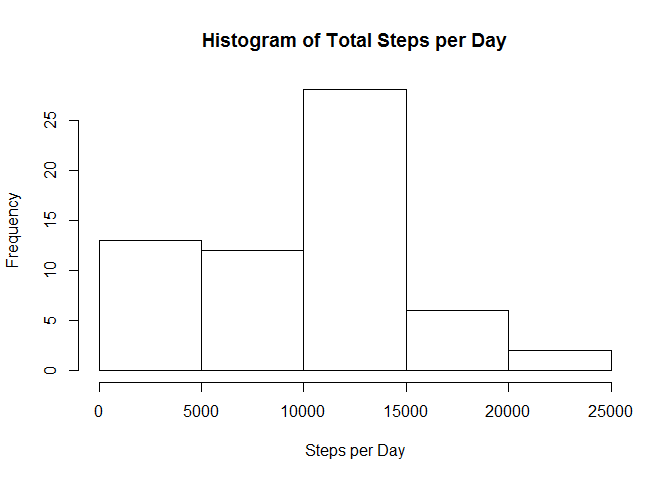
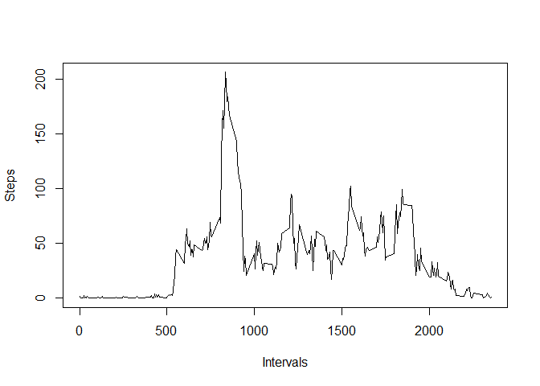
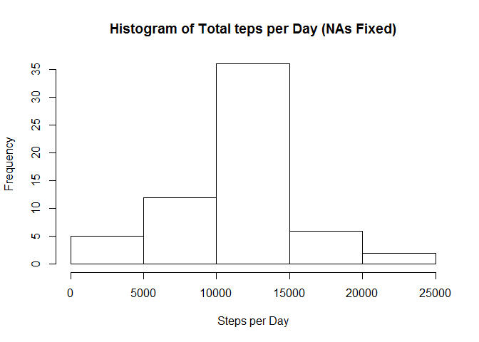
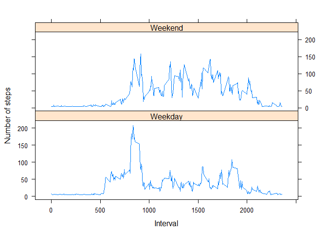

# Course Project 1
Andrew Diodati  
June 5, 2016  

This markdown file contains all of the R code and corresponding output for Project 1 in the Reproducible Research Coursera class offered by John Hopkins University. The code and output is presented in order shown in the rubric. Original code was one long function which is given in an appendix. This function had to be broken up for use in the R markdown file.

###Preparing the Data:

```r
  library(package = "lattice")
  
  # read in the data
  data <- read.csv("activity.csv")
  
  # format the date column into a Date
  data$date <- strptime(data$date, format="%Y-%m-%d")
  data$date <- as.Date(data$date)
```

###Total Number of steps taken per day:

```r
  # get the sums of steps for each date
  sums <- tapply(data$steps, data$date, sum, na.rm = TRUE)
  sums
```

```
## 2012-10-01 2012-10-02 2012-10-03 2012-10-04 2012-10-05 2012-10-06 
##          0        126      11352      12116      13294      15420 
## 2012-10-07 2012-10-08 2012-10-09 2012-10-10 2012-10-11 2012-10-12 
##      11015          0      12811       9900      10304      17382 
## 2012-10-13 2012-10-14 2012-10-15 2012-10-16 2012-10-17 2012-10-18 
##      12426      15098      10139      15084      13452      10056 
## 2012-10-19 2012-10-20 2012-10-21 2012-10-22 2012-10-23 2012-10-24 
##      11829      10395       8821      13460       8918       8355 
## 2012-10-25 2012-10-26 2012-10-27 2012-10-28 2012-10-29 2012-10-30 
##       2492       6778      10119      11458       5018       9819 
## 2012-10-31 2012-11-01 2012-11-02 2012-11-03 2012-11-04 2012-11-05 
##      15414          0      10600      10571          0      10439 
## 2012-11-06 2012-11-07 2012-11-08 2012-11-09 2012-11-10 2012-11-11 
##       8334      12883       3219          0          0      12608 
## 2012-11-12 2012-11-13 2012-11-14 2012-11-15 2012-11-16 2012-11-17 
##      10765       7336          0         41       5441      14339 
## 2012-11-18 2012-11-19 2012-11-20 2012-11-21 2012-11-22 2012-11-23 
##      15110       8841       4472      12787      20427      21194 
## 2012-11-24 2012-11-25 2012-11-26 2012-11-27 2012-11-28 2012-11-29 
##      14478      11834      11162      13646      10183       7047 
## 2012-11-30 
##          0
```

###Histogram of the Steps per Day:

```r
  # graph the sums
  hist(sums, xlab="Steps per Day", main="Histogram of Total Steps per Day")
```

<!-- -->

###Average Daily Activity Pattern:

```r
 # mean and median of sums
  means <- mean(sums)
  means
```

```
## [1] 9354.23
```

```r
  medians <- median(sums)
  medians
```

```
## [1] 10395
```

```r
  # plot the time series of the 5-minute interval and the average steps taken, avereaged across all days
  interval_means <- tapply(data$steps, data$interval, mean, na.rm = TRUE)
  plot(row.names(interval_means), interval_means, type = "l", ylab="Steps", xlab="Intervals")
```

<!-- -->

###Max Interval:

```r
  # find the max interval
  max_interval <- interval_means[max(interval_means)]
  max_interval
```

```
##     1705 
## 56.30189
```

###Calculate Number of NAs:

```r
  # count the NAs
  na_count <- sum(is.na(data))
  na_count
```

```
## [1] 2304
```

###Fill NA Strategy with Mean of All Steps:

```r
  # calculate the total mean for all steps (to replaces NAs later)
  total_mean <- mean(data$steps, na.rm = TRUE)
```

###Create a New Dataset with NAs Fixed:

```r
  # create a copy of the data but with the NAs replaced
  new_data <- data
  new_data[is.na(new_data)] <- total_mean
```

###Histogram of Total Steps (NAs Fixed):

```r
  # sums, mean, medians, and histogram for  the new data
  new_sums <- tapply(new_data$steps, new_data$date, sum, na.rm = TRUE)
  new_sums
```

```
## 2012-10-01 2012-10-02 2012-10-03 2012-10-04 2012-10-05 2012-10-06 
##   10766.19     126.00   11352.00   12116.00   13294.00   15420.00 
## 2012-10-07 2012-10-08 2012-10-09 2012-10-10 2012-10-11 2012-10-12 
##   11015.00   10766.19   12811.00    9900.00   10304.00   17382.00 
## 2012-10-13 2012-10-14 2012-10-15 2012-10-16 2012-10-17 2012-10-18 
##   12426.00   15098.00   10139.00   15084.00   13452.00   10056.00 
## 2012-10-19 2012-10-20 2012-10-21 2012-10-22 2012-10-23 2012-10-24 
##   11829.00   10395.00    8821.00   13460.00    8918.00    8355.00 
## 2012-10-25 2012-10-26 2012-10-27 2012-10-28 2012-10-29 2012-10-30 
##    2492.00    6778.00   10119.00   11458.00    5018.00    9819.00 
## 2012-10-31 2012-11-01 2012-11-02 2012-11-03 2012-11-04 2012-11-05 
##   15414.00   10766.19   10600.00   10571.00   10766.19   10439.00 
## 2012-11-06 2012-11-07 2012-11-08 2012-11-09 2012-11-10 2012-11-11 
##    8334.00   12883.00    3219.00   10766.19   10766.19   12608.00 
## 2012-11-12 2012-11-13 2012-11-14 2012-11-15 2012-11-16 2012-11-17 
##   10765.00    7336.00   10766.19      41.00    5441.00   14339.00 
## 2012-11-18 2012-11-19 2012-11-20 2012-11-21 2012-11-22 2012-11-23 
##   15110.00    8841.00    4472.00   12787.00   20427.00   21194.00 
## 2012-11-24 2012-11-25 2012-11-26 2012-11-27 2012-11-28 2012-11-29 
##   14478.00   11834.00   11162.00   13646.00   10183.00    7047.00 
## 2012-11-30 
##   10766.19
```

```r
  hist(new_sums, xlab="Steps per Day", main="Histogram of Total teps per Day (NAs Fixed)")
```

<!-- -->

###Calculate Mean & Median of New Dataset:

```r
  new_means <- mean(new_sums)
  new_means
```

```
## [1] 10766.19
```

```r
  new_medians <- median(new_sums)
  new_medians
```

```
## [1] 10766.19
```

**Note:** The above mean and median do indeed differ from the old ones:

```r
  means
```

```
## [1] 9354.23
```

```r
  medians
```

```
## [1] 10395
```

Adjusting for missing values brought the mean and median closer together and made the histogram more normally distributed.

###Create Factor Variable for Weekday/Weekend:

```r
  # get the weekdays
  days <- weekdays(new_data$date)
  
  # identify weekend dates
  weekend <- vector()
  for (i in 1:nrow(new_data)) {
    if (days[i] == "Saturday" || days[i] == "Sunday") {
      weekend[i] <- "Weekend"
    } 
    else {
      weekend[i] <- "Weekday"
    }
  }
  # create a new column for weekend or not
  new_data$weekend <- weekend
  new_data$weekend <- factor(new_data$weekend)
```

###Panel Plot for Intervals and Average Steps Across all Weekdays/Weekends:

```r
  # aggregate (as opposed to using tapply like previously; just for fun)
  steps <- aggregate(steps ~ interval + weekend, data = new_data, mean)
  names(steps) <- c("interval", "weekend", "steps")
  
  # plot by weekend or weekday
  xyplot(steps ~ interval | weekend, steps, type = "l", layout = c(1, 2), 
         xlab = "Interval", ylab = "Number of steps")
```

<!-- -->

###Code Appendix:

```r
my_function <- function() {
  #install the lattice package
  library(package = "lattice")
  
  # read in the data
  data <- read.csv("activity.csv")
  
  # remove NAs
  ## data <- data[complete.cases(data), ]
  
  # format the date column into a Date
  data$date <- strptime(data$date, format="%Y-%m-%d")
  data$date <- as.Date(data$date)
  
  # get the sums of steps for each date
  sums <- tapply(data$steps, data$date, sum, na.rm = TRUE)
  
  # graph the sums
  hist(sums)
  
  # mean and median of sums
  means <- mean(sums)
  means
  medians <- median(sums)
  medians
  
  # plot the time series of the 5-minute interval and the average steps taken, avereaged across all days
  interval_means <- tapply(data$steps, data$interval, mean, na.rm = TRUE)
  plot(row.names(interval_means), interval_means, type = "l")
  
  # find the max interval
  max_interval <- interval_means[max(interval_means)]
  
  # count the NAs
  na_count <- sum(is.na(data))
  na_count
  
  # calculate the total mean for all steps (to replaces NAs later)
  total_mean <- mean(data$steps, na.rm = TRUE)
  
  # create a copy of the data but with the NAs replaced
  new_data <- data
  new_data[is.na(new_data)] <- total_mean
  
  # sums, mean, medians, and histogram for  the new data
  new_sums <- tapply(new_data$steps, new_data$date, sum, na.rm = TRUE)
  new_sums
  hist(new_sums)
  new_means <- mean(new_sums)
  new_means
  new_medians <- median(new_sums)
  new_medians
  
  # get the weekdays
  days <- weekdays(new_data$date)
  
  # identify weekend dates
  weekend <- vector()
  for (i in 1:nrow(new_data)) {
    if (days[i] == "Saturday" || days[i] == "Sunday") {
      weekend[i] <- "Weekend"
    } 
    else {
      weekend[i] <- "Weekday"
    }
  }
  # create a new column for weekend or not
  new_data$weekend <- weekend
  new_data$weekend <- factor(new_data$weekend)
  
  # aggregate (as opposed to using tapply like previously; just for fun)
  steps <- aggregate(steps ~ interval + weekend, data = new_data, mean)
  names(steps) <- c("interval", "weekend", "steps")
  
  # plot by weekend or weekday
  xyplot(steps ~ interval | weekend, steps, type = "l", layout = c(1, 2), 
         xlab = "Interval", ylab = "Number of steps")
}
```
